# Data Types in Go

## Go 语言数组

- 声明数组

  - 需要指定元素类型及元素个数，语法格式如下：

```go
    var variable_name [SIZE] variable_type
```

例如：

```go
    var balance [12] float64
```

- 初始化数组

```go
var balance = [5] float32{1000.0, 2.0, 6.4, 5.6, 9.0}
```

- 访问数组元素

```go
var salary float32 = balance[9]
salary := balance[9] // 简写方式
```

- 更多内容

|      内容      |        描述        |
| :------------: | :-----------------: |
|    多维数组    | Go 语言支持多维数组 |
| 向函数传递数组 | 像函数传递数组参数 |

- 多维数组

```go
var variable_name [SIZE1][SIZE2] ...[SIZEN] variable_type
```

例如：

```go
var three_dim [5][10][4] int
```

```go
// 初始化一个3行4列的二维数组
a = [3][4] int {
    {1, 2, 3, 4},
    {5, 6, 7, 8},
    {9, 10, 11, 12}
}

// 访问
int val = a[2][3]
```

### Go 语言向函数传递数组

- 方式一：形参设定数组大小：

```go
void myFunction(param [10]int){
    // 函数体
}
```

- 方式二：形参未设定数组大小：

```go
void myFunction(param []int){
    // 函数体
}
```

## Go 指针

声明格式如下：

```go
var var_name *var_type
```

例如：

```go
var ip *int
var fp *float32
```

*空指针*
当一个指针被定义后，但是却没有分配到任何变量时，它的值为nil（空指针）。
概念上与其他语言的null、None、nil、NULL一样，都是指代零值或空值
一个指针变量通常缩写成ptr

### Go 指针更多内容

|         内容         |                     描述                     |
| :------------------: | :------------------------------------------: |
|      Go指针数组      |        可以定义一个指针数组来存储地址        |
|   Go指向指针的指针   |             Go支持指向指针的指针             |
| Go向函数传递指针参数 | 通过引用或地址传参，在函数调用时可以改变其值 |

***Go 指针示意图***



指针声明的格式：

```go
var ptr **int
```

## Go 语言结构体

### 定义结构体

```go
type struct_variable_type struct {
    member definition
    member definition
    ...
    member definition
}
```

一旦定义了结构体类型，它就只能用于变量的声明，语法格式如下：

```go
variable_name := struct_variable_type{value1, value2,..., value_n}

```

- 结构体可以作为函数参数
可以向其他数据类型一样将结构体类型作为参数传递给函数。

#### 结构体指针

可以定义指向结构体的指针类似于其他指针变量，格式如下：

```go
var struct_pointer *Books
```
